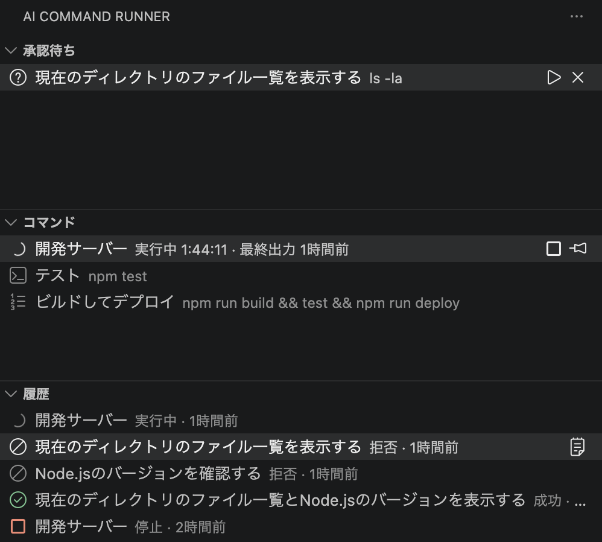

# AI Command Runner

外部AI（Claude Codeなど、ローカルファイルシステムを直接読み書きできるAI）と協働開発するためのVSCode拡張機能です。

AIが「このコマンドを実行して結果を確認したい」と判断したとき、コピー＆ペーストの手作業なしに、サイドバーのボタンひとつで実行できます。実行結果は構造化ログとしてプロジェクト内に書き出され、**AIがそれを直接読んで次の判断に使えます**。とくに、入力の必要なコマンドや、実行を目視で確認したいコマンドだけをAIに要求させ、自分で承認して動かしたい場合に有用です。あわせて、プロジェクト固有のコマンドをVSCodeのtaskより手軽に登録・実行できます。



## 主な機能

- **AIリクエストの承認実行** — AIが書いた実行リクエストを、コマンド全文を確認したうえでワンクリック実行
- **プロジェクトコマンドの管理** — よく使うコマンドを登録し、ピン留め・常駐・順次実行
- **構造化ログ** — 実行結果をJSONと生ログに分けて出力し、AIが直接読める
- **実行履歴** — 過去の実行・拒否を新しい順に一覧
- **常駐プロセスの安全な停止** — `npm run dev` などをプロセスグループごと確実に停止
- **件数バッジ / 実行状態表示** — 承認待ち・実行中の件数や経過時間を可視化

## インストール

Marketplaceには公開していません。以下のいずれかで導入します。

**VSIXから（利用者向け）**

[Releases](https://github.com/N-Kos-mk/vscode-ai-runner/releases/latest) から `.vsix` ファイルをダウンロードし、次のいずれかでインストールします。

```bash
code --install-extension ai-runner-0.1.0.vsix
```

またはVSCodeの拡張パネルの「…」メニュー →「VSIX からのインストール」。

**ソースからビルド（開発者向け）**

```bash
git clone https://github.com/N-Kos-mk/vscode-ai-runner.git
cd vscode-ai-runner
npm install
npm run compile
```

VSCodeで開いて F5（「拡張機能を起動」）すると、Extension Development Host で動作します。`.vsix` を自分で作る場合は `npx @vscode/vsce package` を実行します。

## クイックスタート

1. 拡張を入れた状態で、**使いたいプロジェクトを開く**
2. コマンドパレット（Cmd/Ctrl+Shift+P）で **「AI Runner: ワークスペースを初期化」** を実行 → `.vscode/ai-runner/` 一式が生成される
3. 生成された `.vscode/ai-runner/README.md` を**AIに読ませる**（この拡張の"API仕様"です）
4. あとは、AIにコマンド実行を要求させるか、`commands.json` に自分でコマンドを登録して使う

初期化は最初の一度だけ手動で行います。拡張を入れただけ・プロジェクトを開いただけでは何も生成されません。

## 使い方

### サイドバーの3つのビュー

| ビュー | 内容 |
|---|---|
| 承認待ち | AIが書いたリクエストの承認待ち一覧 |
| コマンド | `commands.json` に登録したコマンド |
| 履歴 | 実行結果を新しい順に表示。クリックでその実行のログが開く |

アクティビティバーのアイコンと各ビューには、承認待ち・実行中の件数がバッジで表示されます。

### 操作

| 操作 | 動作 |
|---|---|
| 項目をクリック | ログを開く（実行中ならそのログ、停止中なら最後の実行ログ） |
| ▶ ボタン | 実行 |
| ■ ボタン | 停止 |

実行はボタンに限定しています。一覧を眺めているだけのつもりが誤クリックで実行される事故を防ぐためです。承認前のAIリクエストだけは例外で、クリックすると整形された詳細パネル（Webview）が開き、種別・作業ディレクトリ・実行されるコマンド全文を確認したうえで、その場で「実行を承認」「拒否」ができます。

実行中の項目には `実行中 2:31 · 最終出力 3秒前` のように経過時間と最終出力からの時間が出ます。スピナーだけでは生きているのか固まっているのか分からないためです（ただし常駐コマンドは正常でも無出力が続くため、無出力は異常の証拠にはなりません）。

ログは実ファイルではなく読み取り専用の仮想ドキュメントとして開きます。実ファイルを直接開くとエクスプローラーが `logs/` を自動展開して大量のログで埋まる（`explorer.autoReveal` の挙動）ためです。手元で `grep` したい場合などは実ファイルを直接開いてください。

### AIリクエストの流れ

```
外部AI
   │ ① リクエストを書き込む
   ▼
.vscode/ai-runner/requests/<requestId>.json
   │ ② 拡張機能が検知し、承認待ちに表示
   ▼
   │ ③ ユーザーが詳細パネルでコマンド全文を確認し承認
   ▼
.vscode/ai-runner/logs/<requestId>.json  ← 概況（status, exitCode, 末尾50行）
.vscode/ai-runner/logs/<requestId>.log   ← 出力全文
   │ ④ AIが直接読む
   ▼
外部AIが結果を踏まえて次の指示を生成
```

リクエストの書式（`requestId`・`label`・`kind`・`command` など）は、初期化で生成される `.vscode/ai-runner/README.md` にAI向けの完全仕様として書かれています。

### コマンド管理

繰り返し使うコマンドは `commands.json` に登録すると、承認なしで常時ワンクリック実行できます。

```json
{
  "commands": [
    {
      "id": "dev",
      "label": "開発サーバー",
      "kind": "daemon",
      "command": "npm run dev"
    },
    {
      "id": "release",
      "label": "ビルドしてデプロイ",
      "kind": "sequence",
      "steps": ["npm run build", "npm test", "npm run deploy"],
      "confirm": true,
      "branches": ["main"]
    }
  ]
}
```

`kind` は `oneshot`（単発）/ `daemon`（常駐）/ `sequence`（順次実行）。`confirm` で実行前確認、`branches` で特定ブランチのみ表示、といった指定ができます。JSON Schemaが登録されているのでエディタ補完が効きます。全フィールドは [schemas/commands.schema.json](schemas/commands.schema.json) を参照してください。

### 設定

| 設定 | 既定 | 説明 |
|---|---|---|
| `aiRunner.requests.confirm` | `true` | AIリクエスト実行前に確認ダイアログを出す |
| `aiRunner.notifyOnComplete` | `true` | コマンド完了時に通知する |
| `aiRunner.logs.maxLines` | `5000` | 1実行あたりに保持するログ行数の上限 |
| `aiRunner.logs.tailLines` | `50` | メタJSONに埋め込む末尾ログの行数 |

## 設計とセキュリティ

### セキュリティ設計

この拡張機能は**任意コマンドを実行する仕組み**であり、その入口となる `requests/` にはAIだけでなく、リポジトリを取得した第三者もファイルを置けます。そのため以下を設計上の前提としています。

- **自動実行しない。** 実行の起点は常にユーザーのクリックです。リクエストを検知しても、勝手に実行する経路は存在しません
- **コマンド全文を必ず表示する。** ラベルだけを見せて中身を隠しません。`label` に嘘が書かれていても、実行されるコマンドはUI上で確認できます
- **既定で確認ダイアログを出す。** `aiRunner.requests.confirm` で無効化できますが、既定は有効です
- **信頼されたワークスペースでのみ動作する。** VSCodeのWorkspace Trustに対応しています
- **`cwd` はワークスペース内に限定される。** 外を指すリクエストは実行前に拒否されます

詳細パネルに表示する内容は外部AIが書いた未検証の文字列なので、HTMLへ差し込む際に全てエスケープし、CSPとnonceで自前スクリプト以外の実行を禁止しています（XSS対策）。なお、コマンドは `shell: true` で実行されます。パイプや `&&` が使える利便性と引き換えに、シェルの解釈を経る点は理解した上でお使いください。

### プロセスの停止

`shell: true` で `npm run dev` を起動すると、実際に動くのは `sh` → `npm` → `node` という孫プロセスです。そのため子プロセスを殺すだけでは孫が生き残り、停止したはずなのにポートが解放されない状態になります。

これを避けるため、子プロセスは `detached: true` で新しいプロセスグループのリーダーとして起動し、停止時は `process.kill(-pid)` でグループ全体にシグナルを送ります（SIGTERM → 猶予後SIGKILL）。VSCode終了時には全プロセスを停止し、終了を待ってから拡張ホストを終わらせます。ただし拡張ホストがクラッシュした場合などは `deactivate()` が呼ばれず、プロセスが残ることがあります（VSCode拡張の構造上の制約です）。

### ログ形式

`logs/<id>.json`（概況）と `logs/<id>.log`（全文）に分かれています。常駐コマンドの出力を単一JSONに押し込むと肥大化してAIがパースできなくなるため分離しました。

```json
{
  "schemaVersion": 1,
  "runId": "run-tests",
  "source": "request",
  "requestId": "run-tests",
  "label": "テストを実行",
  "kind": "oneshot",
  "command": "npm test",
  "cwd": ".",
  "status": "failed",
  "exitCode": 1,
  "startedAt": "2026-07-17T10:00:00.000Z",
  "endedAt": "2026-07-17T10:00:42.000Z",
  "durationMs": 42000,
  "logFile": ".vscode/ai-runner/logs/run-tests.log",
  "tail": ["...末尾50行..."]
}
```

`logs/index.json` に実行履歴が新しい順で最大200件記録されます。常駐コマンドのログは既定で直近5000行のみ保持します（ローテーション）。

## Git管理について

`.vscode/ai-runner/logs/` と `requests/` は実行環境依存の生成物なので、初期化時に生成される `.vscode/ai-runner/.gitignore` で除外されます。プロジェクトルートの `.gitignore` は変更しません。

`commands.json` はチームで共有する価値がある（VSCodeの `tasks.json` と同じ性質）ため、コミットするのが自然です。個人用にしたい場合は `.vscode/ai-runner/.gitignore` に `commands.json` を追記すれば、他の設定に影響を与えず個別に無視できます。

## 開発

```bash
npm install
npm run compile
npm test          # 実行エンジンの結合テスト（node --test）
```

F5（「拡張機能を起動」）で Extension Development Host が立ち上がります。テストは `vscode` モジュールをスタブ化して実行エンジンを素のNodeで走らせ、実際に子プロセスを起動してログ内容・プロセスツリーの停止・ログローテーション・パス検証を確認します。

## ライセンス

MIT License. 詳細は [LICENSE](LICENSE) を参照してください。


## 作成
Claude Sonnet 4.5 / Opus 4.8
